# End to end- testaaminen Cypressilla (Windows 10 & VSCode)

Lisää Cypressista: \
[Cypressin dokumentaatio](https://docs.cypress.io/guides/overview/why-cypress) \
[Full Stack Open- kurssin materiaali](https://fullstackopen.com/osa5/end_to_end_testaus_cypress) 

Sovelluksen End to end- testaaminen hoidetaan Cypressilla. Cypress-testit löytyvät kansiosta `/frontend/cypress/e2e`

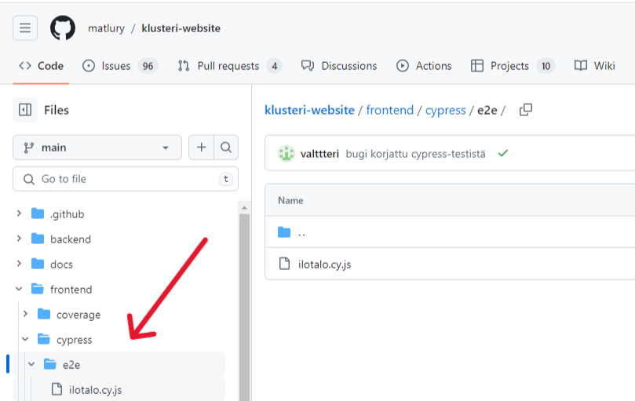

## Alkutoimet

Toisin kuin esimerkiksi Pytest, Cypress ei luo automaattisesti erillistä tietokantaa testien ajamista varten.
Sen sijaan se käyttää samaa tietokantaa kuin itse sovellus. Tämä on luonnollisesti haitallista, joten testejä varten on luotava oma tietokanta manuaalisesti.
Cypress-testeihin voidaan käyttää "CYPRESS_DB_NAME"-nimistä tietokantaa.
Sovelluksen asetuksissa määritellään, että kyseistä nimeä kantava tietokanta otetaan käyttöön kun ympäristömuuttujan "CYPRESS" arvo on "True".

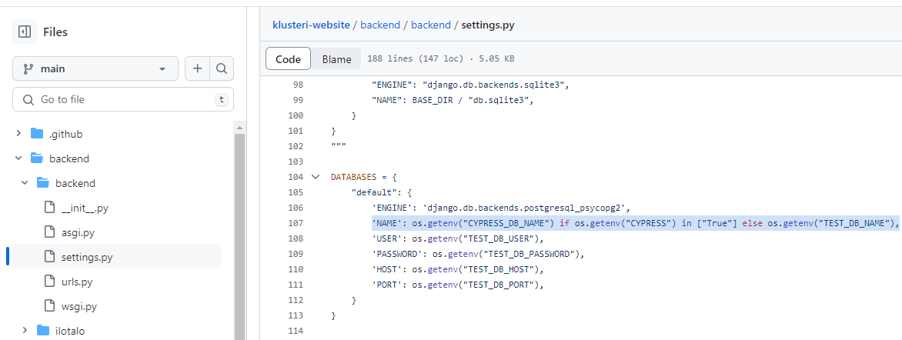

Asetetaan ympäristömuuttujalle haluttu arvo Git Bashin kautta

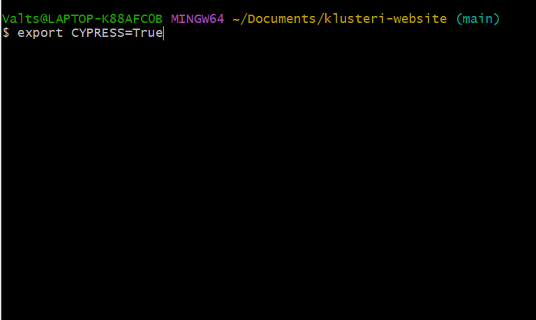

Nyt sovellus käyttää testitietokantaa. Tietokanta on alustettava, jos sen taulut eivät ole ajan tasalla.
```{bash}
~\klusteri-website\backend> python manage.py migrate
```
Cypress olettaa testattavan sovelluksen olevan jo valmiiksi käynnissä kun testit ajetaan. Avataan koodieditori ja käynnistetään frontend ja backend. 

```{bash}
~\klusteri-website\frontend> npm run dev
~\klusteri-website\backend> python manage.py runserver
```

Backendin käynnistyessä havaitaan, että ympäristömuuttujan "CYPRESS" arvo on nyt "True".

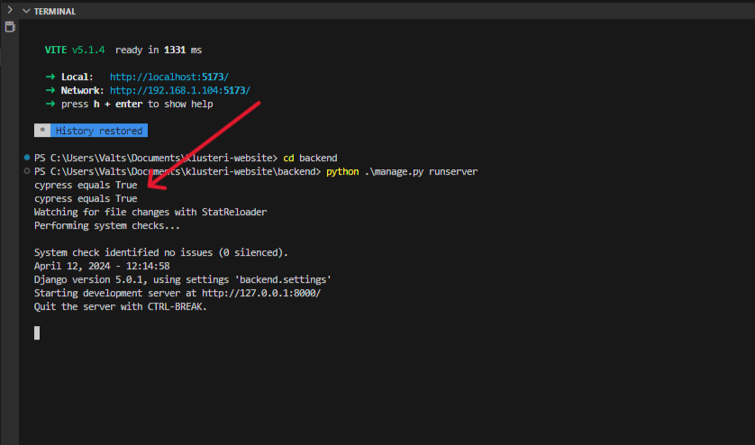

## Testien ajaminen

Kun frontend ja backend ovat käynnissä, avataan Cypress.

```{bash}
~\klusteri-website\frontend> npm run cypress
```

Ruudulle avautuu seuraavanlainen näkymä. Valitaan E2E testing.

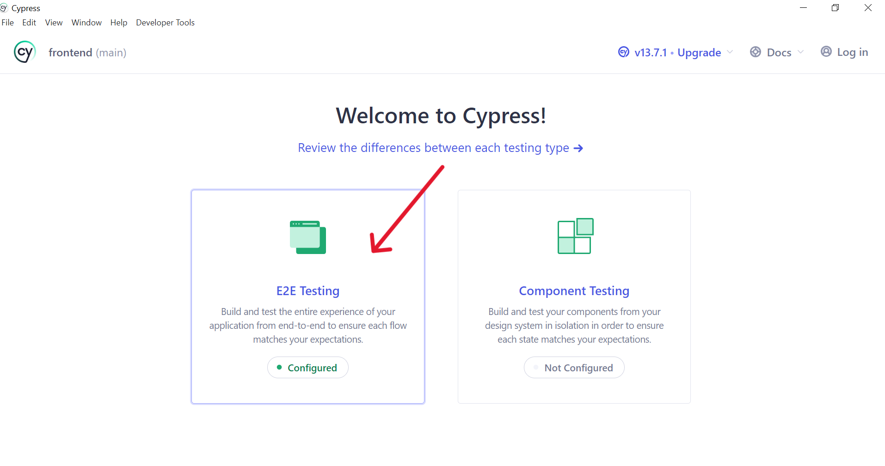

Valitaan testien suoritusympäristöksi Chrome.

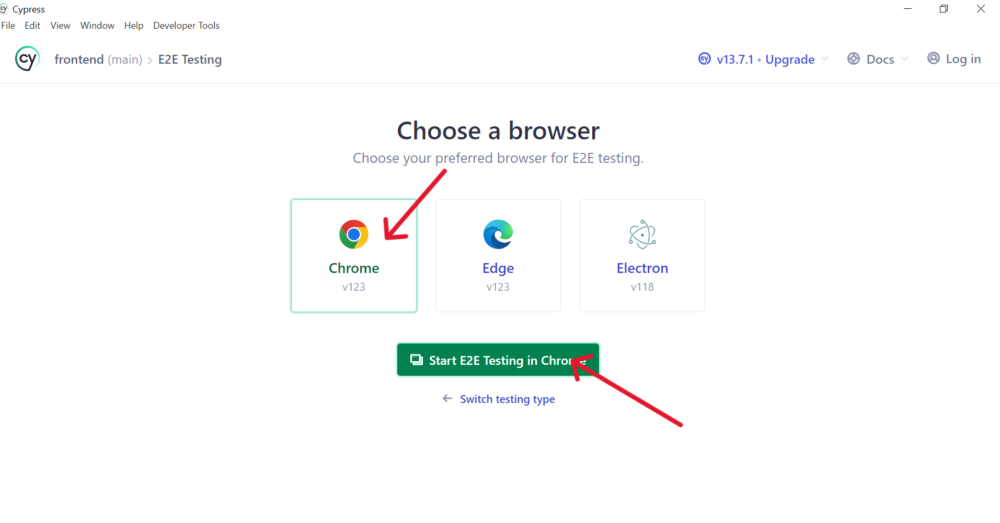

Nyt sovelluksen olemassa olevat Cypress-testitiedostot näkyvät ruudun alaosassa.

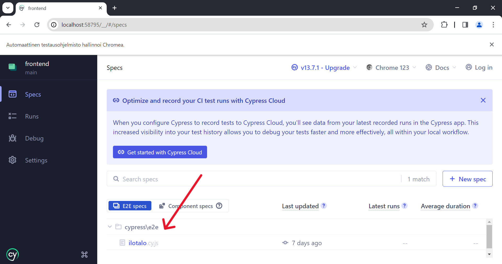

Yksittäisen tiedoston sisältämät testit ajetaan automaattisesti kun tiedosto avataan.

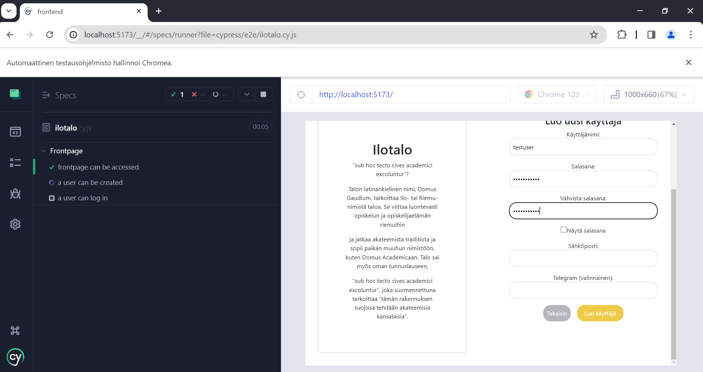

Testit voidaan ajaa uudelleen klikkaamalla "Run all tests".

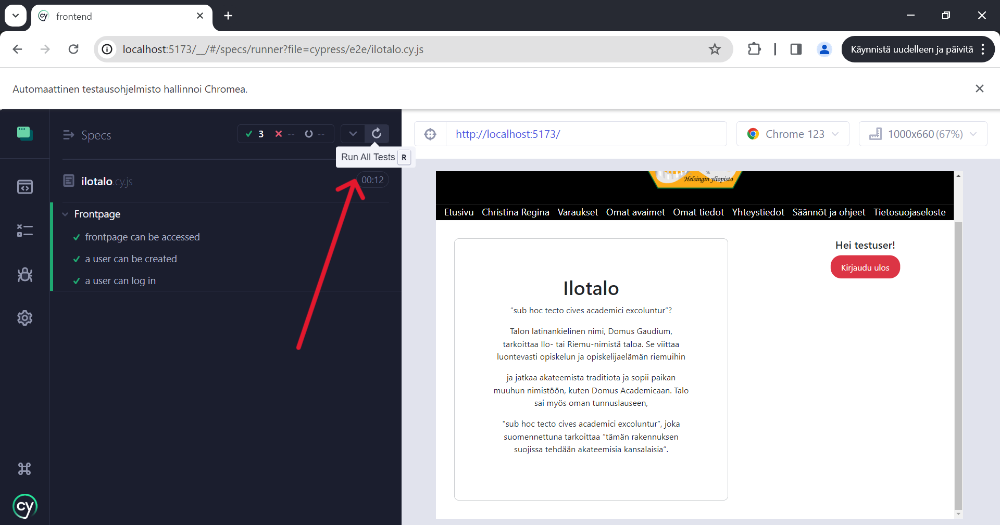

## Jälkitoimet

Kun testejä on ajettu riittävästi, suljetaan Cypress ja vaihdetaan sovellus käyttämään alkuperäistä tietokantaa. Tämä voidaan tehdä sulkemalla koodieditori ja asettamalla ympäristömuuttujan "CYPRESS" arvo joksikin muuksi. 

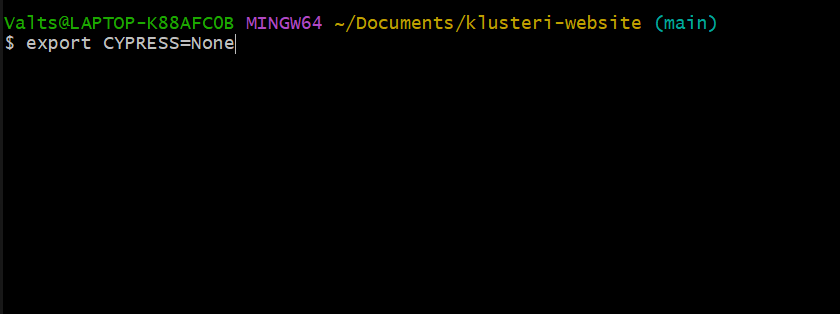

Kun koodieditori avataan uudelleen ja sovellus käynnistetään, havaitaan ympäristömuuttujan "CYPRESS" arvon muuttuneen. Sovellus käyttää jälleen alkuperäistä tietokantaa.

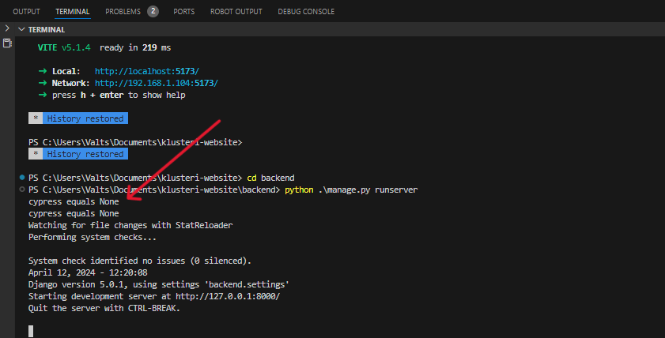
