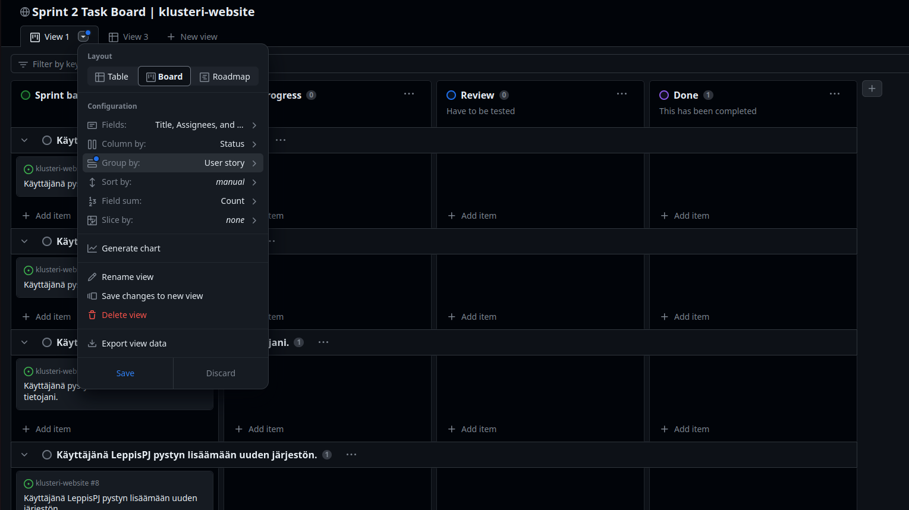

# Product backlog ja Task board ohje

## User storyt ja taskit

Kaikki user storyt ja taskit ovat Github Issueita. Uuden user storyn tai taskin voi luoda joko Issues-sivun kautta tai suoraan Product backlogiin tai Sprint task boardiin.

### Uuden issuen luominen ja lisääminen

Vihree New issue -nappi vie valitsemaan joko Task tai User story templaten.

Uudelle issuelle valitaan oikeelta Assignee(t) ja Label (task tai user story). Muut valinnat ei mun mielestä ole välttämättömiä, mutta voi halutessaan lisätä esim. Milestonen eli mihin sprinttiin issue kuuluu. Projekti valikoituu automaattisesti, kun issue lisätään Product backlogiin tai Task boardille.

Task-issuen kuvaukseen voi lisätä linkin siihen liittyvään user storyyn kirjoittamalla vain user storyn numero.

Task boardille voi lisätä olemassa olevan taskin kumman vain näkymän alareunasta. Kenttään kirjoitetaan `#klusteri-website` ja halutun taskin numero tai nimi. Taskin voi myös etsiä kentän antamasta listasta.

### Uuden issuen luominen suoraan projektiin

Product backlogin ja task boardien alareunasta voi myös luoda suoraan uuden issuen. Kenttään kirjoitetaan sama `#klusteri-website` ja sen jälkeen kentän antamasta listasta valitaan Create new issue.

Projektien kautta voi myös luoda luonnoksia, jolloin alkuun ei anneta repositorion nimeä vaan suoraan kirjoitetaan issuen nimi. Issueta luodessa suoraan projektiin assigneet ja labelit jne. lisätään jälkikäteen (eivät näy Create new issue -näkymässä).

## Product backlog

Sisältää kaikki projektin aikaiset user storyt. Storyt sisältävät Statuksen (Accepted by Customer / In Current Sprint), Priorityn ja Milestonen (mikä sprint). Alareunasta voi lisätä user story -luonnoksia, olemassa olevia tai uusia issueita.

## Sprint task board

Task boardissa näkyy kaikki sprintin aikaiset taskit (ja user storyt) sekä sen missä vaiheessa ne ovat. Taskeja voi raahata sarakkeelta toiselle. Taskit saa auki niiden nimestä painamalla, sieltä pääsee muokkaamaan taskia.

Kun table-näkymän kautta (kuvassa View 3) on luotu sarake User story, jonka optionsit ovat user storyjen nimet, voidaan task boardin sisältö lajitella user storyjen mukaan. Jos user story issueita ei haluta nähdä task boardilla, ne voidaan piilottaa yläreunassa olevan Filter by keyword or by field -kentän kautta. Kenttään kirjoitetaan `label:task`, jolloin boardilla näkyy vain taskit. 

### User story fieldin luominen task boardiin

Fieldin optionsit ovat user storyjen nimiä, mutta niiden kirjoittaminen on aika puuduttavaa niin pitää vielä etsiä, josko löytyisi kätevämpi ratkaisu. Task board on kuitenkin kivemman näköinen, kun taskit on ryhmitelty user storyjen mukaan, niin mennään alustavasti tällä.